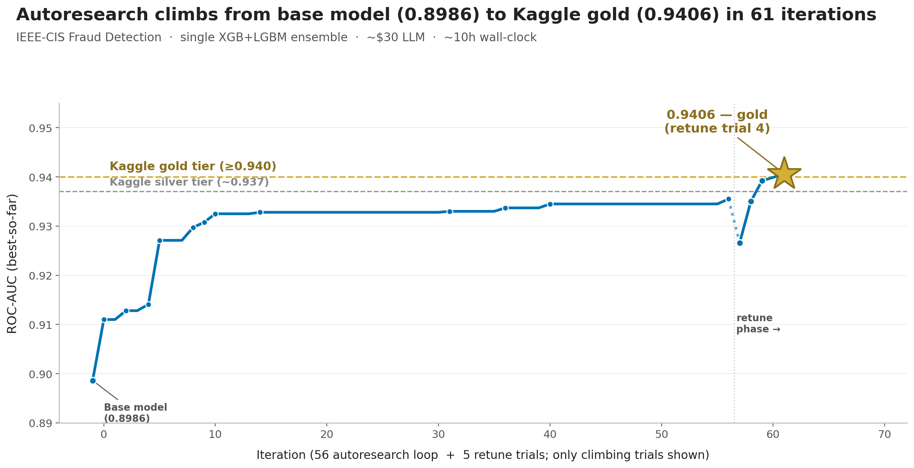

# AI Analyst v2 — Plus Tabular ML (with Self-Learning Research)

[](https://www.python.org/downloads/)
[](LICENSE)
[](https://claude.ai/code)
[](#)

> **Fork of [ai-analyst-lab/ai-analyst](https://github.com/ai-analyst-lab/ai-analyst)** with two extensions: a tabular-ML build framework (15 skills + 5 agents + production reference), and interactive HTML reports as a parallel deliverable to Marp/PDF decks. See [Fork Extensions](#fork-extensions) for details.

An AI product analyst built on Claude Code. You ask a business question, it runs a pipeline of agents that frame the question, explore your data, find the root cause, build a narrative, and hand you a validated slide deck (or interactive HTML report) with speaker notes. Minutes, not weeks.

**24** specialized agents | **55** auto-applied skills | **20** slash commands | DAG-based parallel execution | PDF + interactive HTML export

---

## Before You Start

This is a tool for analysts, not a replacement for them. It handles about 80% of what a human analyst does. The 80% that takes all the time. But it only works if you're the expert.

**You are the eval.** Run this on data you know like the back of your hand. Run it on the reports you were already going to run this week. When it picks the wrong column or misinterprets a metric, you'll catch it immediately because you've written that query before. You correct it, it saves the correction, and it doesn't make that mistake again. That's the whole loop. Look, know, correct, move on.

Don't hand this to someone who can't validate the output. Don't run it on data you've never seen. The analyses it produces need your judgment before they go anywhere near a stakeholder. If you skip the validation, you'll get confident-sounding numbers that might be wrong. If you do the validation, you'll move faster than you ever have.

**The byproduct of building this is the work itself.** You're not taking time off from your job to set up an AI tool. You're doing your actual work through it. The first analysis takes a bit longer because you're connecting data and teaching it your context. By the third one, you're faster than doing it by hand. By next week, you're doing 15 analyses instead of 5.

**This doesn't work out of the box.** It's a starting point, not a finished product. The model capability is there with Opus 4.6, but you need to teach it your data, your metrics, your business context. Correct it when it's wrong. Grow it into something that works for your specific use case, or tear it apart and rebuild it how you want. The agents, skills, and pipeline are all markdown files you can read and modify. Nothing is hidden.

**Bring your own data.** No bundled datasets. Connect your CSVs, DuckDB, Postgres, BigQuery, or Snowflake with `/connect-data` and start analyzing.

---

## What's New in V2

V2 is a ground-up rebuild of the intelligence layer. The pipeline and agents from V1 still work the same way — you won't notice a difference in how you use it. What changed is everything underneath.

| Area | V1 | V2 |
|------|----|----|
| **Data** | Bundled NovaMart e-commerce dataset | Bring your own — CSV, DuckDB, Postgres, BigQuery, Snowflake |
| **Onboarding** | Manual setup, read the docs | `/setup` interview learns your role, data, and business context |
| **Memory** | Stateless across sessions | Knowledge system persists corrections, learnings, query patterns, business glossary |
| **Self-learning** | None | Captures feedback, logs corrections, retrieves proven SQL patterns — never repeats the same mistake |
| **Theming** | Hardcoded chart style | YAML-based theme system with brand colors, WCAG-compliant palettes |
| **Business context** | None | Organization knowledge base — glossary, metrics, products, teams. Notion ingest. |
| **Pipeline** | Single run, restart on failure | Run tracking (`/runs`), reliable resume, comms drafter for Slack/email output |
| **Testing** | Minimal | 606 tests with synthetic fixtures, no external data dependencies |
| **Dataset coupling** | NovaMart table names hardcoded in agents | Fully dataset-agnostic — agents resolve from active manifest and schema |

---

## Fork Extensions

This fork adds three capabilities on top of v2. All are battle-tested patterns codified into the framework's skill/agent model.

### 1. Tabular ML build framework

A coherent build → ship → productionize layer for tabular supervised ML (classification, regression, ranking on tree-based or linear algorithms — panel, cross-sectional, or single-entity time-series data). Deep learning, LLM fine-tuning, and computer vision halt explicitly with redirects; see `agents/FRAMEWORK_GAPS.md`.

The end-to-end story:

```
ml-feature-prep --> ml-model-train --> ml-model-evaluation (optional)
                --> ml-ship-decision --> BUILD_RESULTS.md
                --> ml-productionize --> migration plan referencing AGENTS_ML.md
```

**5 ML agents**, **15 ML skills** (CV, tuning, feature/target engineering, calibration, baseline gates, SHAP-based explanation, library smoke tests), **7 domain BUILD_RESULTS templates** (`cross_sell`, `churn`, `fraud`, `forecast`, `pricing`, `recommendation`, `generic`), and a 765-line vendor-neutral production reference (`agents/AGENTS_ML.md`) covering DAG patterns, watermarking, three-table output schemas, DQ checks, and rollback.

Shipped in [PR #1](https://github.com/running-rikishi/ai-analyst/pull/1).

### 2. Interactive HTML reports

A parallel output deliverable to the existing Marp/PDF decks. Use Marp when the report needs to print well or be PDF-attached; use HTML when stakeholders consume via Slack/email/browser link and want to self-serve exploration.

Every HTML report is a single self-contained `.html` file with drill-down panels on every aggregation chart (click a bar → see breakdowns by other dimensions in tabbed views), view toggles when the data has filter dimensions, hover-explained technical terms, a glossary section at the end, and a help overlay explaining the interactions. Two layouts: vertical (scroll — exec/email/async) and horizontal (scroll-snap — workshops/talks).

The principle: **HTML reports are interactive exploration tools, not static documents. If a stakeholder gets the same information from a screenshot, the format failed.**

Working demo: [`docs/example_report_vertical.html`](docs/example_report_vertical.html). Full guide: [`docs/html-output-guide.md`](docs/html-output-guide.md). Shipped in [PR #2](https://github.com/running-rikishi/ai-analyst/pull/2).

### 3. Autoresearch framework

Autonomous experimentation above `bayesian-tuning`. Where Optuna can only tune hyperparameters within a fixed search space, autoresearch widens the search space — algorithm choice, feature engineering, target reformulation, CV strategy — by having an LLM agent edit a mutable `pipeline.py` across iterations. A post-loop Optuna retune phase then tunes diverse candidates picked by an LLM for architectural variety + tuning upside.

**The framework is general.** Bring your own dataset, problem, target, and harness. Autoresearch adapts to whatever `harness.py` + initial `pipeline.py` + `program.md` you write. The harness defines load + split + scorer; the agent invents features and selects algorithms within the constraints you set; the retune step Optuna-tunes the most promising candidates. The reference benchmark below validates the framework reaches expert-tier results — your own problem will look different in scale, target, and features, and the framework adapts.



**Reference benchmark** (IEEE-CIS Fraud Detection, public Kaggle): autoresearch reached **0.9406 ROC-AUC — Kaggle gold tier (≥0.94)** in ~67 total iterations (56 loop + retune), beating an Optuna-tuned baseline by **+2.04%**. Single XGB+LGBM ensemble, **~$30 LLM cost**, **~10h wall-clock**. All agent-engineered features pass the interpretability gate (no PolynomialFeatures, no hash encoding, no opaque cross-products).

Architecture: three-file separation (fixed harness, mutable pipeline, human-edited program.md), hill-climb-from-best, in-loop smoke test, feature-name lint, per-iter snapshots, Optuna retune with LLM-curated picks, interpretability gate, $250 cost cap, env-only API keys. See `.claude/skills/autoresearch-loop/skill.md` for the canonical rules and `agents/ml-autoresearch.md` for the agent contract.

**When to use:** tabular supervised ML with a clean target metric (classification, regression, ranking on tree-based or linear algorithms). Out of scope: deep learning, computer vision, LLM fine-tuning, and tacit-knowledge expert tasks (legal review, medical judgment) where the technique library isn't well-represented in LLM training.

Inspired by [Karpathy's autoresearch](https://github.com/karpathy/autoresearch), adapted for tabular ML. Shipped in [PR #4](https://github.com/running-rikishi/ai-analyst/pull/4).

### Continuous improvement loop

All three extensions plug into the v2 corrections system. When stakeholder feedback surfaces a new pattern, log it via `/log-correction` and the relevant skill grows; the agent's templates follow whatever the skill says. The ML framework's severity gates, the HTML output's interaction patterns, and autoresearch's runner-architecture rules were all built this way — every rule traces to a real correction, not invented from theory.

---

## Don't Know What to Do? Just Ask.

Claude knows the entire system — every agent, skill, command, and dataset. If you're stuck, ask it:

```
What can I do with this data?
What should I run to refresh the deck?
How do I connect my own CSV files?
Which agents handle root cause analysis?
Re-run just the chart maker and deck creator.
```

Claude will tell you the exact command. You don't need to memorize anything in this README. Think of it as a reference — Claude is the guide.

---

## Quick Start

**1. Install Claude Code** (requires a [Claude Pro subscription](https://claude.ai/pro))

```bash
npm install -g @anthropic-ai/claude-code
```

**2. Clone and set up**

```bash
git clone https://github.com/running-rikishi/ai-analyst.git
cd ai-analyst
pip install -e ".[dev]"
```

> Cloning the upstream `ai-analyst-lab/ai-analyst` works too if you only want v2 without the fork extensions.

**3. Start Claude Code**

```bash
claude
```

**4. Connect your data and go**

```
/connect-data
```

Or skip the wizard and just ask a question with your data in a directory:

```
/run-pipeline data_path=data/my_csvs/ question="Why is conversion dropping?"
```

For full setup details: [docs/setup-guide.md](docs/setup-guide.md)

---

## Five Things You Can Do

### 1. Ask a quick question

```
What's our conversion rate by device?
```

Claude queries the data and returns an answer with a chart. Simple questions get answered in under 2 minutes without running the full pipeline.

### 2. Run a full analysis

```
/run-pipeline data_path=data/your_dataset/ question="What's driving the decline in conversion?"
```

The pipeline runs the agents across 4 phases: Frame the question, Analyze the data, Build the story, Create the deck. You get a validated analysis, branded charts, a narrative, and either a slide deck with speaker notes (default) or an interactive HTML report — set `FORMAT=html` to route step 16 to the HTML Report Maker instead of the Deck Creator. Both export options coexist.

### 3. Explore a dataset

```
/explore
```

Interactive data browsing without committing to a full analysis. Preview tables, check distributions, spot patterns, form hypotheses. Use `/data users` to inspect a specific table's schema.

### 4. Connect your own data

```
/connect-data
```

Guided wizard that walks you through connecting CSV files, local DuckDB, Postgres, BigQuery, or Snowflake. Auto-profiles your data, creates schema docs, and remembers your dataset context across sessions.

### 5. Make a single chart

```
Make a funnel chart of the checkout flow, highlighting the biggest drop-off step.
```

Claude generates a chart following Storytelling with Data methodology: warm off-white background, decluttered axes, action title, direct labels instead of legends.

---

## How It Works: The Pipeline

When you run `/run-pipeline`, Claude orchestrates 18 agents across 4 phases:

```
1. FRAME              2. ANALYZE                          3. STORY                 4. DECK
+-----------------+   +-----------------------------+   +--------------------+   +------------------+
| Question        |   | Data Explorer               |   | Story Architect    |   | Storytelling     |
|   Framing       |   |   > Source Tie-Out           |   |   > Coherence      |   |   > Deck Creator |
|   > Hypothesis  |   |   > Descriptive Analytics    |   |     Reviewer       |   |   > Slide Review |
|     Generation  |   |   > Root Cause Investigator  |   |   > Chart Maker    |   |   > Close the    |
|                 |-->|   > Validation               |-->|   > Design Critic  |-->|     Loop         |
+-----------------+   |   > Opportunity Sizer        |   +--------------------+   +------------------+
                      +-----------------------------+
```

**Phase 1 — Frame:** Structures your business question into analytical questions with testable hypotheses. Checkpoint: review the framing before analysis begins.

**Phase 2 — Analyze:** Explores the data, verifies loading integrity, runs segmentation/funnel/drivers analysis, drills down to root cause, validates findings, and sizes the opportunity. Checkpoint: automated quality gate.

**Phase 3 — Story:** Designs a storyboard (Context-Tension-Resolution arc), generates charts with collision detection, and reviews visual quality against a 16-point checklist.

**Phase 4 — Deck:** Writes a stakeholder narrative, then builds either a branded Marp slide deck with HTML components (default) or an interactive HTML report with drill-downs, view toggles, hover tooltips, and a glossary (`FORMAT=html`). Reviews the chosen output, and ensures every recommendation has a follow-up plan. Marp exports to PDF + HTML; the HTML report ships as a single self-contained `.html`.

You don't have to run the whole thing. Five execution plans let you run just the part you need:

| Plan | Use When | What Runs |
|------|----------|-----------|
| `full_presentation` | Complete analysis to slide deck | All 18 agents |
| `deep_dive` | Analysis without presentation | Phases 1-2 only |
| `quick_chart` | Just need one chart | Chart Maker + Design Critic |
| `refresh_deck` | Re-do the presentation layer | Phases 3-4 (reuses analysis) |
| `validate_only` | Check existing work | Validation + Source Tie-Out |

```
/run-pipeline data_path=data/your_dataset/ question="..." plan=deep_dive
```

If the pipeline gets interrupted, resume where you left off:

```
/resume-pipeline
```

Preview what would run without executing:

```
/run-pipeline data_path=data/your_dataset/ question="..." dry-run=true
```

---

## How It Works: The DAG Engine

The pipeline doesn't run agents one at a time. It resolves dependencies automatically and runs independent agents in parallel:

```
Tier 0 (parallel)    Question Framing -----> Hypothesis
                     Data Explorer --------> Source Tie-Out
                                                  |
Tier 2 (parallel)              Descriptive Analytics  /  Overtime Trend  /  Cohort Analysis
                                        |
Tier 3 (sequential)           Root Cause --> Validation --> Opportunity Sizer
                                                                |
Tier 4 (sequential)           Story Architect --> Coherence Review
                                                       |
Tier 5 (parallel fan-out)     Chart Maker (per beat) --> Design Critic
                                                              |
Tier 6 (sequential)           Storytelling --> Deck Creator --> Slide Review --> Close the Loop
```

- **Parallel execution:** Agents in the same tier run concurrently (up to 3 at once). Tier 0 starts Question Framing and Data Explorer simultaneously.
- **Automatic dependency resolution:** The engine reads `agents/registry.yaml` and computes execution tiers using topological sort.
- **Circuit breaker:** If 3 agents fail in the same tier, the pipeline halts with a diagnostic report.
- **Timeouts:** Each agent gets 5 minutes. One retry on timeout. Critical agents (source tie-out, validation) halt the pipeline; non-critical agents (design critic) degrade gracefully.
- **Checkpoints:** Quality gates between phases. Two are automated (analysis verification, final deck lint). Two are user-facing (frame review, storyboard review). Say "just do it" to skip the user-facing ones.

---

## All Commands

| Command | What It Does | Example |
|---------|-------------|---------|
| `/run-pipeline` | Full analysis to slide deck | `/run-pipeline data_path=data/your_dataset/ question="Why is conversion dropping?"` |
| `/resume-pipeline` | Resume interrupted pipeline | `/resume-pipeline` |
| `/explore` | Interactive data exploration | `/explore events` |
| `/data` | Show active dataset schema | `/data users` |
| `/datasets` | List all connected datasets | `/datasets` |
| `/switch-dataset` | Change the active dataset | `/switch-dataset my_dataset` |
| `/connect-data` | Add a new data source | `/connect-data` |
| `/setup` | Interactive onboarding interview | `/setup` |
| `/metrics` | Browse the metric dictionary | `/metrics conversion_rate` |
| `/history` | View past analyses | `/history` |
| `/patterns` | View recurring patterns | `/patterns --global` |
| `/export` | Export results in various formats | `/export slides` or `/export email` or `/export slack` |
| `/forecast` | Generate a time-series forecast | `/forecast` |
| `/runs` | List, inspect, compare pipeline runs | `/runs` |
| `/business` | Browse organization knowledge | `/business glossary` |
| `/log-correction` | Log a data or methodology correction | `/log-correction` |
| `/architect` | Multi-persona planning methodology | `/architect` |
| `/notion-ingest` | Import business context from Notion | `/notion-ingest` |
| `/compare-datasets` | Compare metrics across datasets | `/compare-datasets` |
| `/setup-dev-context` | Add codebase context for dev teams | `/setup-dev-context` |

Or just ask in plain English. "Show me conversion by device" works as well as any command.

---

## Charts and Visualization

Every chart follows the Storytelling with Data methodology:

```
Your Data --> chart_helpers.py --> Base Chart (150 DPI)
                                      |
                              Collision Check
                              (3 fix strategies)
                                      |
                              Marp Deck (HTML components)
                                      |
                              marp_linter.py (8 check categories)
                                      |
                              marp_export.py --> PDF + HTML
```

**What happens automatically:**

- `swd_style()` applies warm off-white background (#F7F6F2), removes chart clutter (gridlines, borders, redundant legends), sets consistent typography
- Every chart gets an action title (takeaway statement, not a label) and a subtitle (data source, time range)
- Direct labels replace legends wherever possible
- Collision detection checks for overlapping text with 3 auto-fix strategies: offset the label, reduce font size, or drop the least important label. Charts with unresolved collisions halt the pipeline.
- The deck uses branded HTML components: KPI cards, finding cards, recommendation rows, so-what callouts, before/after panels, timelines, and more
- A lint gate validates every deck before export: checks frontmatter completeness, HTML component usage (minimum 3 types), valid slide classes, slide count, and pacing
- YAML-based theming with brand color overrides and WCAG-compliant palettes (see [docs/theming.md](docs/theming.md))

---

## Your Data

This repo ships clean — no bundled datasets. Connect your own data and the system builds context around it.

### Connect your own

Run `/connect-data` for a guided setup wizard, or `/setup` for a full onboarding interview. Supported sources:

- **CSV files** — drop them in a directory, point Claude at it
- **DuckDB** — local or MotherDuck
- **Postgres** — any Postgres-compatible database
- **BigQuery** — Google BigQuery with service account
- **Snowflake** — Snowflake with user/password or key pair

The system auto-profiles your data, creates schema documentation, notes data quirks, and remembers context across sessions in `.knowledge/datasets/`.

### Example datasets

Curated public datasets with README guides are available in `data/examples/`.

### Fallback chain

If your primary connection fails, the system falls back automatically:

1. Primary connection (e.g., MotherDuck via MCP)
2. Local DuckDB (from `manifest.local_data.duckdb`)
3. CSV files via pandas (from `manifest.local_data.path`)

You're always told which source is active.

---

## What Just Happened? (Output Guide)

After running a pipeline, here's what you'll find:

```
outputs/
  question_brief_YYYY-MM-DD.md          # Your question, structured
  hypothesis_doc_YYYY-MM-DD.md          # Testable hypotheses
  data_inventory_YYYY-MM-DD.md          # What data exists
  analysis_report_YYYY-MM-DD.md         # Full analysis with findings
  validation_<dataset>_YYYY-MM-DD.md    # Independent validation of findings
  narrative_<dataset>_YYYY-MM-DD.md     # Stakeholder-ready story
  deck_<dataset>_YYYY-MM-DD.marp.md    # Slide deck (Marp source, when FORMAT=marp)
  deck_<dataset>_YYYY-MM-DD.pdf        # PDF export (when FORMAT=marp)
  deck_<dataset>_YYYY-MM-DD.html       # HTML export of the Marp deck (when FORMAT=marp)
  report_<dataset>_YYYY-MM-DD.html     # Interactive HTML report (when FORMAT=html)
  close_the_loop_YYYY-MM-DD.md         # Follow-up plan for recommendations
  charts/                               # All generated charts

working/                                # Intermediate files (safe to delete)
  pipeline_state.json                   # Pipeline progress (for /resume-pipeline)
  pipeline_metrics.json                 # Execution timing and parallel efficiency
  storyboard_<dataset>.md              # Story beats + visual mapping
  design_review_<dataset>.md           # Chart quality review (16-point checklist)
  investigation_<dataset>.md           # Root cause drill-down log
  sizing_*.md                           # Opportunity sizing with sensitivity analysis
```

`outputs/` contains your deliverables. `working/` contains intermediate artifacts that support resumability and debugging.

---

## Customization

| Want to... | Do this |
|-----------|---------|
| Change how Claude thinks | Edit `CLAUDE.md` (the AI's persona, rules, workflow) |
| Add a new skill | Create `.claude/skills/my-skill/skill.md`, reference it in `CLAUDE.md` |
| Add a new agent | Create `agents/my-agent.md` using `agents/CONTRACT_TEMPLATE.md` as a starting point |
| Change the slide theme | Create a YAML theme in `themes/brands/` (see [docs/theming.md](docs/theming.md)) |
| Add deck components | Edit `templates/marp_components.md` (snippet library) |
| Modify the pipeline | Edit `.claude/skills/run-pipeline/skill.md` (rules, checkpoints, execution) |
| Add to the agent DAG | Edit `agents/registry.yaml` (dependencies, execution order) |

---

<details>
<summary><strong>All 24 Agents</strong> (click to expand)</summary>

Agents are markdown prompt templates in the `agents/` directory. Each defines a multi-step workflow with `{{VARIABLES}}` that get filled in at runtime. To invoke one, ask Claude to run it or use `/run-pipeline` to orchestrate all of them.

### Framing

| Agent | What It Does | Pipeline Step |
|-------|-------------|---------------|
| question-framing | Turns a business problem into structured analytical questions with hypotheses and data requirements | 1 |
| hypothesis | Generates testable hypotheses across cause categories: product changes, technical issues, external factors, mix shift | 3 |

### Data Discovery

| Agent | What It Does | Pipeline Step |
|-------|-------------|---------------|
| data-explorer | Profiles a dataset: schema, distributions, quality, gaps, supported analyses | 4 |
| source-tieout | Verifies data loaded correctly by comparing pandas vs DuckDB on row counts, nulls, and sums. Halts on mismatch. | 4.5 |

### Analysis

| Agent | What It Does | Pipeline Step |
|-------|-------------|---------------|
| descriptive-analytics | Segmentation, funnel analysis, and drivers analysis to identify what happened and why | 5 |
| overtime-trend | Time-series analysis: trends, anomalies, seasonality, annotated timeline charts | 5 |
| cohort-analysis | Retention curves, cohort comparison, vintage analysis, cohort LTV | 5 |
| root-cause-investigator | Iteratively drills down through dimensions to find the specific, actionable root cause | 6 |
| validation | 4-layer verification: structural, logical, business rules, and Simpson's Paradox checks | 7 |
| opportunity-sizer | Quantifies business impact with sensitivity analysis showing which assumptions matter most | 8 |

### Storytelling

| Agent | What It Does | Pipeline Step |
|-------|-------------|---------------|
| story-architect | Designs a storyboard with Context-Tension-Resolution arc, maps beats to visual formats and HTML components | 9 |
| narrative-coherence-reviewer | Reviews the storyboard for story gaps, beat flow, and progressive depth before any charting | 10 |
| chart-maker | Generates SWD-styled charts with collision detection and action titles | 12 |
| visual-design-critic | Reviews charts against a 16-point SWD checklist plus 5 gotcha checks and 6 advanced technique checks. Also reviews slide-level deck design. | 13/17 |

### Presentation

| Agent | What It Does | Pipeline Step |
|-------|-------------|---------------|
| storytelling | Converts findings into a stakeholder-ready narrative with executive summary, findings, insight, and recommendations | 15 |
| deck-creator | Builds a branded Marp slide deck with HTML components, speaker notes, and correct theme styling | 16 (when `FORMAT=marp`) |
| html-report-maker | Builds a self-contained interactive HTML report with drill-downs, view toggles, hover tooltips, and a glossary | 16 (when `FORMAT=html`) |
| comms-drafter | Generates stakeholder communications: Slack summary, email brief, exec summary | 19 |

### Standalone

| Agent | What It Does | Pipeline Step |
|-------|-------------|---------------|
| experiment-designer | Designs A/B tests with power estimation, guardrail selection, and decision rules | (on demand) |

### ML Build Framework (fork extension)

Invoked on demand for tabular supervised ML projects. See [Fork Extensions](#fork-extensions) above and `agents/AGENTS_ML.md` for the production reference.

| Agent | What It Does |
|-------|-------------|
| ml-feature-prep | Hygiene, imputation, leak audit, target profiling before training |
| ml-model-train | Task-routed CV + tuning + ensemble + SHAP; supports {classification, regression, ranking} × {panel, cross-sectional, time-series} × {tree, linear} |
| ml-model-evaluation | Post-train CV evaluation as a separate pass |
| ml-ship-decision | Baseline gate + anchor stress test + rolling backtest; produces `BUILD_RESULTS.md` from one of 7 domain templates |
| ml-productionize | Given a SHIP verdict, generates a stack-specific migration plan |

</details>

---

<details>
<summary><strong>All 55 Skills</strong> (click to expand)</summary>

Skills are instruction files in `.claude/skills/` that Claude follows automatically when a trigger condition matches. You don't invoke them manually. When you ask for a chart, the Visualization Patterns skill activates. When you start an analysis, the Data Quality Check skill runs.

### Always Active

These skills shape every interaction:

| Skill | What It Does |
|-------|-------------|
| analysis-design-spec | Ensures every analysis starts with a plan: question, decision, data needed, success criteria |
| close-the-loop | Every recommendation gets a decision owner, success metric, follow-up date, and fallback plan |
| data-quality-check | Validates data completeness and consistency before analysis begins |
| data-profiling | Deep-profiles schema, distributions, temporal patterns, and anomalies |
| feedback-capture | Captures user corrections and methodology guidance to the learnings system |
| first-run-welcome | Adaptive onboarding for new users based on available data |
| guardrails | Pairs every success metric with a guardrail metric; checks positive findings for trade-offs |
| knowledge-bootstrap | Loads active dataset context, schema, quirks, and user profile at session start |
| metric-spec | Standardized template for defining metrics with no ambiguity |
| question-framing | Structures vague business questions using the Question Ladder framework |
| question-router | Classifies questions L1-L5 and routes to the right response path |
| semantic-validation | 4-layer validation stack plus confidence scoring |
| stakeholder-communication | Adapts findings to the audience: same insight, different framing |
| tracking-gaps | Identifies when required data doesn't exist and produces instrumentation requests |
| triangulation | Cross-references findings against multiple sources before presenting |
| visualization-patterns | Ensures every chart follows SWD design standards |
| archaeology | Retrieves proven SQL patterns from query archaeology before writing new queries |

### On-Demand (Slash Commands)

These activate when you use a command:

| Skill | Command | What It Does |
|-------|---------|-------------|
| run-pipeline | `/run-pipeline` | End-to-end analysis with DAG execution, checkpoints, and export |
| resume-pipeline | `/resume-pipeline` | Resume interrupted work from last completed agent |
| explore | `/explore` | Quick interactive data exploration |
| export | `/export` | Export as slides, email, Slack message, or data |
| connect-data | `/connect-data` | Guided wizard to add a new dataset |
| switch-dataset | `/switch-dataset` | Change the active dataset |
| datasets | `/datasets` | List all connected datasets with status |
| data-inspect | `/data` | Show active schema, optionally drill into a table |
| metrics | `/metrics` | Browse and manage metric dictionary entries |
| history | `/history` | View past analyses from the archive |
| patterns | `/patterns` | View recurring patterns across analyses |
| forecast | `/forecast` | Generate time-series forecasts |
| compare-datasets | `/compare-datasets` | Compare metrics across two datasets |
| setup | `/setup` | Interactive onboarding interview for profile, data, and business context |
| setup-dev-context | `/setup-dev-context` | Add codebase context for dev teams |
| runs | `/runs` | List, inspect, compare, and clean up pipeline runs |
| business | `/business` | Browse organization knowledge (glossary, metrics, products, teams) |
| log-correction | `/log-correction` | Deliberate correction logging for methodology fixes |
| architect | `/architect` | Multi-persona planning methodology for new projects |
| notion-ingest | `/notion-ingest` | Crawl Notion workspace to extract business context |

### Presentation & Knowledge

| Skill | What It Does |
|-------|-------------|
| presentation-themes | Theme standards for slide decks: layouts, typography, color palettes |
| html-output-patterns | Severity-graded rules for HTML reports — progressive disclosure, drill-downs, view toggles, hover tooltips, glossary, self-containment, layout selection |
| archive-analysis | Saves completed analyses to the knowledge system for future recall |

### ML Build Framework Skills (fork extension)

15 procedural skills covering the tabular ML build pipeline. See [Fork Extensions](#fork-extensions) above.

| Skill | Trigger |
|-------|---------|
| feature-hygiene | Before training any model on tabular data — drop IDs/dates/leakage/zero-variance, add NaN indicators |
| target-engineering | Defining a regression or classification target — forward-shift, market adjustment, winsorization, skew/balance diagnostics |
| smart-imputation | Semantic NaN handling (recency cols vs counts) |
| forward-chaining-cv | Temporal CV on entity-time panel data with entity-aware holdout |
| hybrid-cv | Mixed temporal + stratified CV for sparse positives |
| oot-window-selection | Out-of-time validation window sizing rules |
| rolling-backtest | Walk-forward backtest harness with distribution shift diagnostics |
| bayesian-tuning | Optuna TPE with warm-start across related products |
| recall-optimization | 5-lever procedure for minority-class recall |
| f1-optimization | Balanced harmonic-mean tuning, same 5-lever framework |
| ensemble-calibration | Platt scaling, isotonic, calibration curves |
| ml-baseline-gate | Simple-baseline ship/demote decision (1.5× over LogReg-K) |
| shapley-values | TreeExplainer + peer-relative SHAP |
| shap-rep-explanations | Sales-rep-readable tooltip with anchor stress test |
| library-compat-smoke-test | 30-second stack-level sanity check before multi-hour training |

</details>

---

<details>
<summary><strong>All Helper Modules</strong> (click to expand)</summary>

Python modules in `helpers/` that agents call during execution:

### Charts and Visualization

| Module | What It Does |
|--------|-------------|
| `chart_helpers.py` | Core SWD charting: `swd_style()`, `highlight_bar()`, `highlight_line()`, `action_title()`, `annotate_point()`, `save_chart()`, `stacked_bar()`, `retention_heatmap()`, `sensitivity_table()`, `funnel_waterfall()`, `big_number_layout()`, `check_label_collisions()` |
| `chart_palette.py` | WCAG-compliant color palettes with brand override support |
| `chart_style_guide.md` | Full SWD reference: color palette, declutter checklist, chart decision tree, anti-patterns |
| `analytics_chart_style.mplstyle` | Matplotlib style file: off-white background, no top/right spines, sans-serif, 150 DPI |
| `marp_linter.py` | Validates Marp decks: frontmatter, HTML components, slide classes, pacing, title collisions |
| `marp_export.py` | Exports Marp decks to PDF and HTML via Marp CLI with theme resolution |
| `theme_loader.py` | YAML-based theme system with brand color loading and inheritance |

### Data and SQL

| Module | What It Does |
|--------|-------------|
| `data_helpers.py` | Data source abstraction: `detect_active_source()`, `check_connection()`, `read_table()`, `list_tables()` |
| `sql_helpers.py` | SQL sanity checks: join cardinality, percentage sums, date bounds, duplicates, temporal coverage |
| `sql_dialect.py` | SQL dialect router for Postgres, BigQuery, Snowflake, DuckDB |
| `connection_manager.py` | Unified interface for multi-warehouse connections |
| `tieout_helpers.py` | Source tie-out: dual-path comparison (pandas vs DuckDB) with tolerances |
| `schema_profiler.py` | Automated schema discovery and documentation |

### Analytics and Statistics

| Module | What It Does |
|--------|-------------|
| `analytics_helpers.py` | Analytical utilities for segmentation, decomposition, and driver analysis |
| `stats_helpers.py` | Statistical tests: proportion, mean, Mann-Whitney, chi-squared, bootstrap CI, effect size |
| `forecast_helpers.py` | Time-series forecasting with trend and seasonality detection |
| `deep_profiler.py` | Advanced data quality: distributions, correlations, completeness, anomalies |

### Validation

| Module | What It Does |
|--------|-------------|
| `structural_validator.py` | Layer 1: schema, primary keys, completeness checks |
| `logical_validator.py` | Layer 2: aggregation consistency, trend logic |
| `business_rules.py` | Layer 3: plausibility checks against domain rules |
| `business_validation.py` | Business rule validation against organization knowledge |
| `simpsons_paradox.py` | Layer 4: Simpson's Paradox scanner |
| `confidence_scoring.py` | Synthesizes all 4 layers into an A-F confidence grade |

### Knowledge & Context

| Module | What It Does |
|--------|-------------|
| `context_loader.py` | Loads active dataset context, schema, quirks at session start |
| `archaeology_helpers.py` | Query archaeology: retrieve and match proven SQL patterns |
| `business_context.py` | Organization knowledge: glossary, metrics, products, teams |
| `entity_resolver.py` | Disambiguates entity references across datasets |
| `metric_validator.py` | Validates metric definitions against schema |
| `schema_migration.py` | Handles schema version migrations for knowledge files |
| `miss_rate_logger.py` | Tracks knowledge system miss rates for improvement |

### System

| Module | What It Does |
|--------|-------------|
| `error_helpers.py` | Friendly error messages with suggestions |
| `file_helpers.py` | Atomic file writes, content hashing, safe YAML I/O |
| `health_check.py` | System health diagnostics for data connectivity and dependencies |
| `lineage_tracker.py` | Tracks data lineage from source through transformations to findings |
| `pipeline_state.py` | Pipeline state management for run tracking and resume |

</details>

---

## Requirements

- **Python 3.10+**
- **Node.js 18+** (for Claude Code)
- **Claude Code** with a [Claude Pro subscription](https://claude.ai/pro) ($20/month)
- **Internet connection** (for Claude API and optional MotherDuck)

---

## Getting Help

- **Setup guide:** [docs/setup-guide.md](docs/setup-guide.md)
- **Theming:** [docs/theming.md](docs/theming.md)
- **HTML output guide:** [docs/html-output-guide.md](docs/html-output-guide.md)
- **ML framework reference:** [agents/AGENTS_ML.md](agents/AGENTS_ML.md), [agents/FRAMEWORK_GAPS.md](agents/FRAMEWORK_GAPS.md)
- **Fork bugs/questions:** Open a [GitHub Issue](https://github.com/running-rikishi/ai-analyst/issues)
- **Upstream questions:** Open one against [ai-analyst-lab/ai-analyst](https://github.com/ai-analyst-lab/ai-analyst/issues)

---

## License

[MIT](LICENSE) -- use it however you want.
